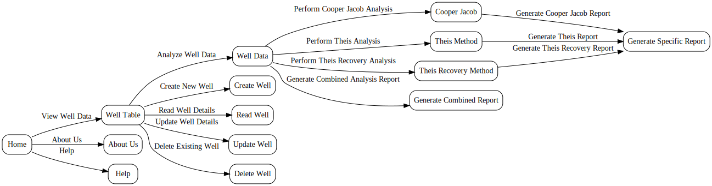
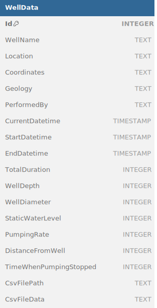

# AquaProbe

  

AquaProbe - Groundwater Analysis Standalone Desktop Application

## Description

The Central Ground Water Board (CGWB) suggests developing a standalone desktop application for the analysis and interpretation of pumping test data. This application is intended to be distributed as freeware for use by groundwater professionals, researchers, students, teachers, and others. Groundwater plays a pivotal role in the world's water supply, and its gradual depletion and contamination underscore the urgent need to investigate aquifer reactions to various human activities.

Pumping tests, also known as aquifer performance tests, are the standard method for determining the hydraulic parameters of aquifers. They are conducted on a large scale by organizations like the CGWB and State Groundwater Departments. The parameters derived from pumping tests, such as transmissivity, storativity, and specific yield, are essential for groundwater-related studies. However, the analysis and interpretation of pumping test data can be tedious and are usually done using computer applications. Currently, there are no Indian software available for this purpose.

To address this need, CGWB proposes to develop a standalone desktop application for the analysis and interpretation of pumping test data. The application will include modules for interpretation using standard methods such as Theiss, Theiss recovery, and Jacob methods. Users will be able to enter data directly using forms or import it from existing data sources.

## Expected Outcome

The expected outcome is a standalone desktop application for the analysis and interpretation of pumping test data. The application will offer modules for interpretation involving standard methods like Theiss, Theiss recovery, and Jacob methods. Additionally, an innovative approach may be attempted to design the most complete set of tools for aquifer test data input, analysis, visualization, interpretation, and reporting.

## Organization

Central Ground Water Board (CGWB), Ministry of Jal Shakti

## Features

- **Well Data Management**: Allows users to manage well data including creation, reading, updating, and deletion of well information.
- **Analysis Tools**: Provides analysis tools such as Cooper Jacob, Theis, and Theis Recovery methods for groundwater analysis.
- **Graphical Interpretation**: Visualizes well data and analysis results through interactive graphs and plots.
- **Report Generation**: Generates comprehensive reports including method-specific and combined analysis reports in PDF format.

## Technologies Used

- Python
- PyQt5 for GUI development
- SQLite for database management
- Plotly for interactive data visualization
- FPDF for PDF report generation

## Installation

1. Clone the repository: `git clone https://github.com/dhairyashil-G/CGWB-Desktop-App.git`
2. Install the required dependencies: `pip install -r requirements.txt`
3. Run the application: `python main.py`

## Usage

1. Launch the application by running `main.py`.
2. Use the navigation menu to access different features such as well data management, analysis tools, and help sections.
3. Input well data and select the desired analysis method.
4. Visualize and interpret analysis results through the interactive graphs.
5. Generate and download analysis reports for further review and sharing.

## Screenshots

### Flowchart

  

### Database Structure

  

## License

This project is licensed under the MIT License - see the [LICENSE](LICENSE) file for details.

## Contributors

- [Sahil Gidwani](https://github.com/sahil-gidwani)
- [Dhairyashil Ghatage](https://github.com/dhairyashil-G)

## Acknowledgements

We extend our gratitude to the following individuals and organizations:

- Dr. Praveen Kumar - Domain Expert CGWB
- Dr. Ranjan Kumar Ray - Domain Expert CGWB
- Sanjay Jotwani - Technical Mentor
- Vikas Baloda - Technical Mentor
- [Devyani Toshniwal](https://github.com/Devyanit09)
- [Andreas de Jong](https://www.youtube.com/@GeosearchInternational)
- [Urdhvam Environmental Technologies Pvt. Ltd.](https://www.linkedin.com/company/urdhvam-environmental-technologies-pvt-ltd/)

Your support and contributions have been invaluable to the success of this project. Thank you for your dedication and assistance.
